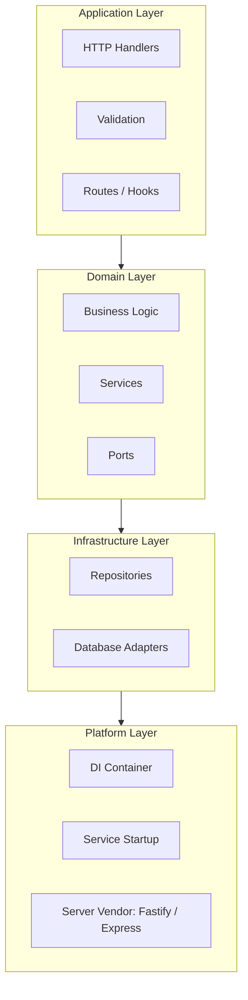
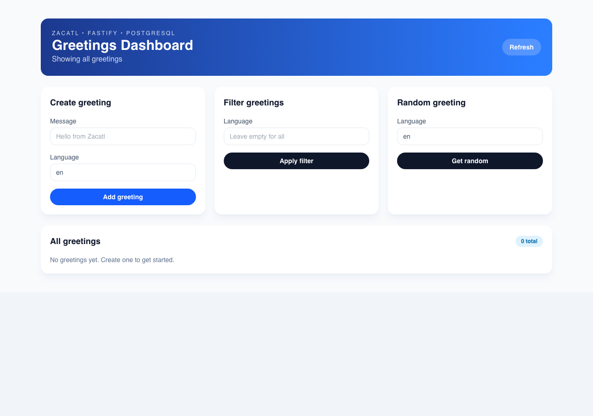

# Zacatl Framework

**Package** · [](https://www.npmjs.com/package/@sentzunhat/zacatl) [](https://www.npmjs.com/package/@sentzunhat/zacatl) [](./LICENSE)

**Quality** · [](https://github.com/sentzunhat/zacatl/actions/workflows/ci.yml) [](#-testing) [](#-testing)
<br>One `CI` badge, deliberately — it's a single orchestrator workflow that gates CVE scanning, peer-dependency install checks, the full test suite, and an 8-example Docker smoke matrix before anything can tag a release. A separate "CVE scan" badge would just go stale (see [docs/guidelines/ci-cd-workflow.md](./docs/guidelines/ci-cd-workflow.md) for exactly what runs where and why).

**Stack** · [](https://www.typescriptlang.org/) [](https://nodejs.org/)

**Universal TypeScript framework for building APIs, CLI tools, and distributed systems.**

Zacatl enforces layered (hexagonal) architecture with built-in dependency injection, type-safe validation, and structured error handling — designed for both human developers and AI agents to collaborate effectively. It doesn't replace [Fastify](https://fastify.dev), [Express](https://expressjs.com), [Mongoose](https://mongoosejs.com), or [Sequelize](https://sequelize.org) — it wires them together behind a consistent, testable architecture, so swapping HTTP framework or database vendor is a config change, not a rewrite.

Zacatl was built with the help of AI models and digital agents, and is intentionally designed to be navigable by both humans and automated tooling alike.

## Table of Contents

- [Why Zacatl](#-why-zacatl)
- [Quick Start](#-quick-start)
- [ORM Adapters](#️-orm-adapters)
- [Architecture](#️-architecture)
- [Platform Support](#-platform-support)
- [Examples & Screenshots](#-examples--screenshots)
- [Public API Modules](#-public-api-modules)
- [Documentation](#-documentation)
- [Testing](#-testing)
- [Requirements](#-requirements)
- [Contributing](#-contributing)
- [License](#-license)

## ✨ Why Zacatl

| Capability                  | Detail                                                             |
| ---------------------------- | ------------------------------------------------------------------ |
| 🏗️ Layered Architecture     | Strict Application → Domain → Infrastructure → Platform layers     |
| 💉 Dependency Injection     | Built-in DI container via `tsyringe`                                |
| ✅ Type-Safe Validation     | Zod schema support; Yup and optional validation planned            |
| 🛡️ Structured Errors        | 7 custom error types with correlation IDs                          |
| 🗄️ Pluggable ORM Adapters   | Sequelize, Mongoose, built-in SQLite via `node:sqlite`, or custom   |
| 🌐 Server Framework Choice  | Fastify or Express — same domain logic, swap the adapter           |
| 🌍 Internationalization     | Pluggable i18n with filesystem/memory adapters                     |
| 📝 Production Observability | Structured logging and error tracking                              |
| 🧪 Tested                   | 659 tests, 91%+ coverage — see [Testing](#-testing)                |

## 🚀 Quick Start

```bash
npm install @sentzunhat/zacatl
```

> Core server dependencies are installed with Zacatl. ORM/database adapters use optional peer dependencies (`mongoose`, `mongodb`, `sequelize`, `sqlite3`, `pg`) that you install based on what your service uses. SQL projects that use Zacatl's Sequelize adapter should install `sequelize` plus the dialect driver, for example `pg` or `sqlite3`.
>
> Audit note for 0.0.57+: non-SQL consumers should not install `sequelize`, and should not inherit Sequelize's nested audit surface through Zacatl core. SQL consumers that explicitly install `sequelize` own that SQL dependency tree. Apps that only need local SQLite can use Zacatl's `node:sqlite` path on Node 26 without external `sqlite3` or Sequelize.

```typescript
import Fastify from 'fastify';
import { Service, ServiceType, ServerType, ServerVendor } from '@sentzunhat/zacatl/service';

const fastify = Fastify();

const service = new Service({
  type: ServiceType.SERVER,
  layers: {
    application: { entryPoints: { rest: { hooks: [], routes: [] } } },
    domain: { services: [] },
    infrastructure: { repositories: [] },
  },
  platforms: {
    server: {
      name: 'hello-service',
      server: { type: ServerType.SERVER, vendor: ServerVendor.FASTIFY, instance: fastify },
    },
  },
});

await service.start({ port: 3000 });
```

See [examples/](./examples/) for eight production-ready starters spanning Express/Fastify × SQLite/PostgreSQL/MongoDB × React/Svelte.

## 🗄️ ORM Adapters

Zacatl doesn't reimplement your database driver — it registers the real thing (Mongoose, Sequelize, or Node's built-in `node:sqlite`) on the service's `platforms.server.databases` list, and gives repositories a consistent shape regardless of which one you picked.

**Mongoose** (excerpt from [`examples/fastify-mongodb-react`](./examples/fastify-mongodb-react)):

```typescript
import mongoose from 'mongoose';
import { DatabaseVendor } from '@sentzunhat/zacatl/service/platforms/server/database/port';

const serviceConfig = {
  // ...
  platforms: {
    server: {
      // ...
      databases: [
        {
          vendor: DatabaseVendor.MONGOOSE,
          instance: mongoose,
          connection: { url: process.env.MONGO_URI ?? 'mongodb://localhost:27017/myapp' },
          indexes: { bootMode: 'create' }, // 'off' | 'create' | 'sync' — safe by default in prod
        },
      ],
    },
  },
};
```

**`node:sqlite`** — zero extra dependencies, no `sequelize` or `sqlite3` needed on Node 26+:

```typescript
import { DatabaseVendor } from '@sentzunhat/zacatl/service/platforms/server/database/port';

const databases = [{ vendor: DatabaseVendor.NODE_SQLITE, connection: { url: './data/app.db' } }];
```

**Sequelize** (Postgres, MySQL, SQLite via the traditional driver) follows the same `databases[]` shape with `DatabaseVendor.SEQUELIZE` — see [docs/third-party/README.md](./docs/third-party/README.md) for the full adapter matrix, and [docs/migration/sequelize-sqlite-to-nodesqlite.md](./docs/migration/sequelize-sqlite-to-nodesqlite.md) if you're moving a small app off Sequelize SQLite.

## 🏗️ Architecture



Dependencies flow strictly inward — Application depends on Domain, Domain depends on Infrastructure ports (not concrete adapters), and Platform wires the concrete Fastify/Express/Mongoose/Sequelize instances in at startup. The public API surface is stable; internal modules may change between minor versions.

## 🎯 Platform Support

| Platform      | Status              |
| ------------- | -------------------- |
| Server (HTTP) | Stable                |
| CLI           | Planned (stub only)   |
| Desktop       | Planned (stub only)   |

> For non-HTTP scripts and workers today, use the standalone DI helpers from `@sentzunhat/zacatl/dependency-injection` directly.

## 📸 Examples & Screenshots

Every example implements the same greeting CRUD flow behind a different framework/database/frontend combination, so you can compare them directly. Screenshots (and the walkthrough below) are captured automatically via Playwright against the real, dockerized app — not mockups.

**Fastify + MongoDB + React**, full create → update → delete cycle:


| Example                                                        | Server  | Database   | Frontend | Preview                                                                         |
| ---------------------------------------------------------------- | ------- | ---------- | -------- | -------------------------------------------------------------------------------- |
| [fastify-sqlite-react](./examples/fastify-sqlite-react)         | Fastify | SQLite     | React    |                  |
| [fastify-mongodb-react](./examples/fastify-mongodb-react)       | Fastify | MongoDB    | React    |                 |
| [fastify-postgres-react](./examples/fastify-postgres-react)     | Fastify | PostgreSQL | React    |                |
| [fastify-sqlite-svelte](./examples/fastify-sqlite-svelte)       | Fastify | SQLite     | Svelte   |                 |

The full gallery (all 8 examples × 4 states: initial, after-create, after-update, after-delete) lives in **[examples/README.md](./examples/README.md#screenshots)**.

### Run one locally with Docker

```bash
cd examples/fastify-sqlite-react
docker compose up -d
curl http://localhost:8081/api/greetings
```

Each example builds **one** Docker image containing both the compiled backend and the compiled frontend static files — there's no separate frontend container to wire up. MongoDB/PostgreSQL examples bring their own database sidecar via `docker compose`; SQLite examples need nothing extra. Full architecture, port table, and image-pinning guidance: **[examples/DOCKER.md](./examples/DOCKER.md)**.

## 📦 Public API Modules

| Module                 | Import path                                |
| ----------------------- | -------------------------------------------- |
| Service                | `@sentzunhat/zacatl/service`                |
| Configuration          | `@sentzunhat/zacatl/configuration`          |
| Dependency Injection   | `@sentzunhat/zacatl/dependency-injection`   |
| Errors                 | `@sentzunhat/zacatl/error`                  |
| Logs                   | `@sentzunhat/zacatl/logs`                   |
| Localization           | `@sentzunhat/zacatl/localization`           |
| Utils                  | `@sentzunhat/zacatl/utils`                  |
| Third-party re-exports | `@sentzunhat/zacatl/third-party/*`          |

## 📖 Documentation

Full docs live in **[`docs/`](./docs/README.md)**. New contributors start with **[docs/start-here.md](./docs/start-here.md)**.

| Topic                  | Link                                                                                                    |
| ------------------------ | ----------------------------------------------------------------------------------------------------- |
| Architecture Overview  | [docs/guidelines/framework-overview.md](./docs/guidelines/framework-overview.md)                        |
| Service Module         | [docs/service/README.md](./docs/service/README.md)                                                      |
| Dependency Injection   | [docs/dependency-injection/README.md](./docs/dependency-injection/README.md)                            |
| Configuration          | [docs/configuration/README.md](./docs/configuration/README.md)                                          |
| Errors                 | [docs/error/README.md](./docs/error/README.md)                                                          |
| Logs                   | [docs/logs/README.md](./docs/logs/README.md)                                                            |
| Localization           | [docs/localization/README.md](./docs/localization/README.md)                                            |
| Third-Party + ORM      | [docs/third-party/README.md](./docs/third-party/README.md)                                              |
| ESLint                 | [docs/eslint/README.md](./docs/eslint/README.md)                                                        |
| Utils                  | [docs/utils/README.md](./docs/utils/README.md)                                                          |
| CI/CD Pipeline         | [docs/guidelines/ci-cd-workflow.md](./docs/guidelines/ci-cd-workflow.md)                                 |
| Release Notes          | [docs/changelog.md](./docs/changelog.md)                                                                |
| Migration Guides       | [docs/migration/](./docs/migration/README.md)                                                           |

## 🧪 Testing

```bash
npm test                 # Run all tests
npm run test:coverage    # Coverage report
```

659 tests across 78 files, 91%+ line coverage. CI runs the full suite plus type-check, lint, and an 8-example Docker smoke matrix before any release — see [docs/guidelines/ci-cd-workflow.md](./docs/guidelines/ci-cd-workflow.md) for exactly what gates what.

## 📋 Requirements

- **Node.js**: 26.0.0+
- **npm**: 11.0.0+
- **TypeScript**: 6.0+

## 🤝 Contributing

1. Open an issue describing the change.
2. Branch off it: `git checkout -b issue-<number>/type/description`
3. Add tests, update docs, commit with [Conventional Commits](https://www.conventionalcommits.org/).

See [CONTRIBUTING.md](./CONTRIBUTING.md) for the full guide.

## 📄 License

[Apache License 2.0](./LICENSE) © 2026 Zacatl Contributors

> Zacatl is permissively licensed. Please don't use it to harm people.
