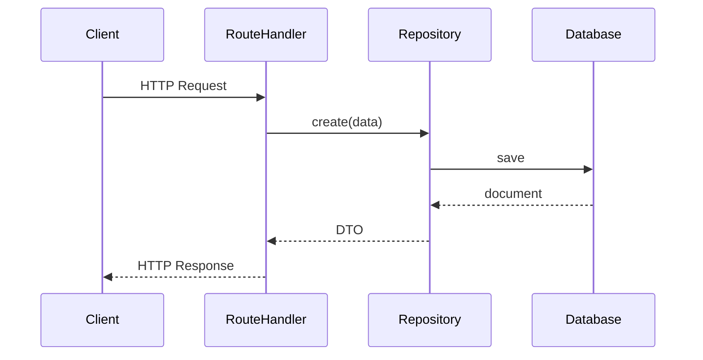

# Quick Start

## Architecture Flow



## Install

```bash
npm install @sentzunhat/zacatl
```

## 1. Create Repository

```typescript
import { BaseRepository } from "@sentzunhat/zacatl";
import { Schema } from "mongoose";

const userSchema = new Schema({ name: String, email: String });

class UserRepository extends BaseRepository<User, CreateUser, UserDTO> {
  constructor() {
    super({ type: "mongoose", name: "User", schema: userSchema });
  }
}
```

## 2. Create Route Handler

```typescript
import { PostRouteHandler } from "@sentzunhat/zacatl";
import { injectable } from "tsyringe";

@injectable()
class CreateUserHandler extends PostRouteHandler {
  constructor(private userRepo: UserRepository) {
    super({ url: "/users", schema: {} });
  }

  async handler(request) {
    return this.userRepo.create(request.body);
  }
}
```

## 3. Start Microservice

```typescript
import Fastify from "fastify";
import mongoose from "mongoose";
import { Service } from "@sentzunhat/zacatl";

const app = Fastify();

const service = new Service({
  architecture: {
    application: {
      entryPoints: {
        rest: { hookHandlers: [], routeHandlers: [CreateUserHandler] },
      },
    },
    domain: { providers: [] },
    infrastructure: { repositories: [UserRepository] },
    server: {
      name: "user-service",
      server: { type: "SERVER", vendor: "FASTIFY", instance: app },
      databases: [
        {
          vendor: "MONGOOSE",
          instance: mongoose,
          connectionString: "mongodb://localhost/mydb",
        },
      ],
    },
  },
});

await service.start({ port: 9000 });
```

## Next Steps

- [ORM Support](../architecture/ORM.md) - Use different databases
- [Full Tutorial](QUICKSTART.md) - Complete guide with all features
- [Examples](../../examples/) - Complete working examples
