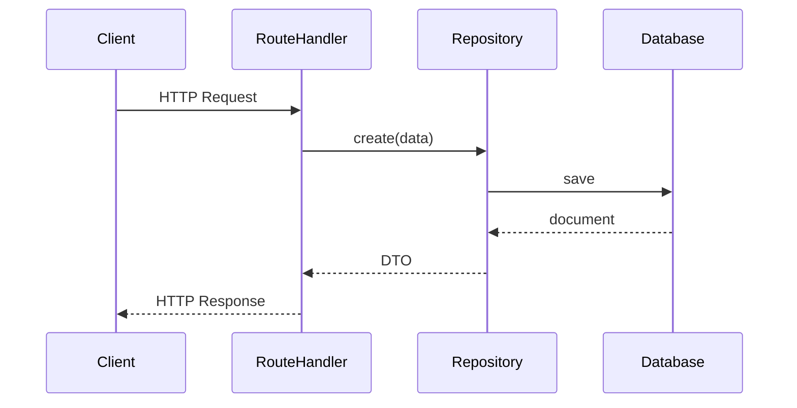

# Quick Start

Get started with Zacatl in 5 minutes.

## Installation

```bash
npm install @sentzunhat/zacatl
```

## Choose Your Path

- **REST API** - Build HTTP services with Fastify
- **CLI Tool** - Build command-line applications
- **Desktop App** - Build Neutralino/Electron apps

## REST API (5 Minutes)

### 1. Basic Setup

```typescript
import Fastify from "fastify";
import {
  Service,
  ServiceType,
  ServerType,
  ServerVendor,
} from "@sentzunhat/zacatl";

const fastifyApp = Fastify();

const service = new Service({
  type: ServiceType.SERVER,
  layers: {
    application: {
      entryPoints: {
        rest: {
          hooks: [],
          routes: [],
        },
      },
    },
    domain: { services: [] },
    infrastructure: { repositories: [] },
  },
  platforms: {
    server: {
      name: "my-service",
      port: 3000,
      server: {
        type: ServerType.SERVER,
        vendor: ServerVendor.FASTIFY,
        instance: fastifyApp,
      },
    },
  },
});

await service.start();
```

### 2. Add a Route Handler

```typescript
import { GetRouteHandler } from "@sentzunhat/zacatl";
import { injectable } from "tsyringe";

@injectable()
class HelloHandler extends GetRouteHandler {
  constructor() {
    super({ url: "/hello" });
  }

  async handle() {
    return { message: "Hello from Zacatl!" };
  }
}

// Register it
const service = new Service({
  type: ServiceType.SERVER,
  layers: {
    application: {
      entryPoints: {
        rest: {
          routes: [HelloHandler],
        },
      },
    },
    domain: { services: [] },
    infrastructure: { repositories: [] },
  },
  platforms: {
    server: {
      name: "my-service",
      port: 3000,
      server: {
        type: ServerType.SERVER,
        vendor: ServerVendor.FASTIFY,
        instance: fastifyApp,
      },
    },
  },
});
```

### 3. Add Database Support

```typescript
import { BaseRepository } from "@sentzunhat/zacatl/infrastructure";
import { Schema } from "mongoose";

const userSchema = new Schema({
  name: String,
  email: String,
});

@injectable()
class UserRepository extends BaseRepository<User, CreateUser, UserDTO> {
  constructor() {
    super({
      type: "mongoose",
      name: "User",
      schema: userSchema,
    });
  }
}

// Use in route handler
@injectable()
class GetUsersHandler extends GetRouteHandler {
  constructor(private userRepo: UserRepository) {
    super({ url: "/users" });
  }

  async handle() {
    const users = await this.userRepo.find({});
    return users;
  }
}
```

## CLI Tool (v0.0.32+)

```typescript
import { Service, ServiceType } from "@sentzunhat/zacatl";

const service = new Service({
  type: ServiceType.CLI,
  layers: {
    application: {
      entryPoints: {
        cli: {
          commands: [MyCommand],
        },
      },
    },
    domain: { services: [] },
    infrastructure: { repositories: [] },
  },
  platforms: {
    cli: {
      name: "my-cli",
      version: "1.0.0",
      description: "My awesome CLI tool",
    },
  },
});

await service.start();
```

## Desktop App (v0.0.32+)

```typescript
import { Service, ServiceType } from "@sentzunhat/zacatl";

const service = new Service({
  type: ServiceType.DESKTOP,
  layers: {
    application: {
      entryPoints: {
        ipc: {
          handlers: [MyIPCHandler],
        },
      },
    },
    domain: { services: [] },
    infrastructure: { repositories: [] },
  },
  platforms: {
    desktop: {
      window: {
        title: "My App",
        width: 800,
        height: 600,
      },
      platform: "neutralino",
    },
  },
});

await service.start();
```

      entryPoints: {
        ipc: {
          handlers: [MyIPCHandler],
        },
      },
    },

},
});

await service.startDesktop();

````

## Import Patterns (v0.1.0+)

Zacatl now supports clean TypeScript path aliases:

```typescript
// ✅ Path aliases (recommended - v0.1.0+)
import { Service, ServiceType } from "@sentzunhat/zacatl";
import { BaseRepository } from "@sentzunhat/zacatl/infrastructure";
import { BadRequestError } from "@sentzunhat/zacatl/errors";
import { logger } from "@sentzunhat/zacatl/logs";
import { createI18n } from "@sentzunhat/zacatl/localization";

// ORM packages via subpath imports only
import { mongoose, Schema } from "@sentzunhat/zacatl/third-party/mongoose";
import { Sequelize } from "@sentzunhat/zacatl/third-party/sequelize";
````

See [Path Aliases Reference](../reference/path-aliases.md) for complete documentation.

## Next Steps

- [Installation Guide](installation.md) - Detailed setup
- [First Service](first-service.md) - Build a complete REST API
- [Database Setup](database-setup.md) - Connect to MongoDB
- [Examples](../examples/README.md) - More examples
- [API Reference](../api/README.md) - Full API documentation

## Architecture Flow



## Common Patterns

### Error Handling

```typescript
import { BadRequestError } from "@sentzunhat/zacatl/errors";

class CreateUserHandler extends PostRouteHandler {
  async handle(request) {
    if (!request.body.email) {
      throw new BadRequestError("Email is required");
    }
    // ...
  }
}
```

### Logging

```typescript
import { logger } from "@sentzunhat/zacatl";

logger.info("User created", { userId: user.id });
logger.error("Failed to create user", { error });
```

### Dependency Injection

```typescript
import { injectable } from "tsyringe";

@injectable()
class UserService {
  constructor(private userRepo: UserRepository) {}
}
```

## Help & Resources

- [Documentation Index](../README.md)
- [GitHub Issues](https://github.com/sentzunhat/zacatl/issues)
- [Migration Guides](../migration/README.md)
