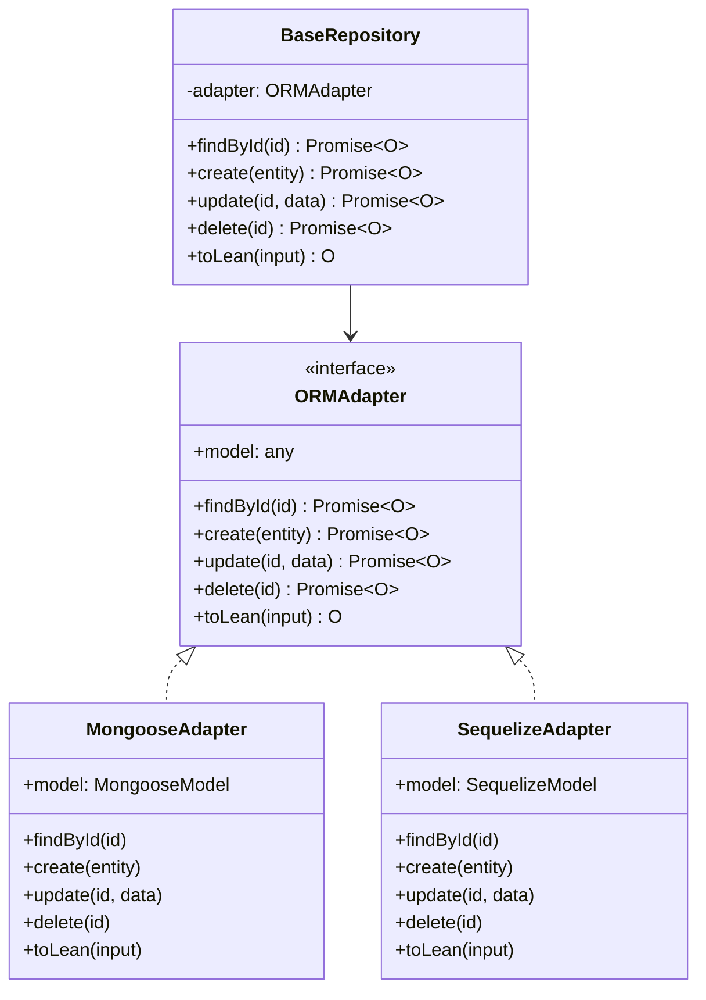

# ORM Adapters - Detailed Guide

## Architecture Overview



## What You Get

- ✅ Use Mongoose or Sequelize (built-in)
- ✅ Create adapters for any ORM (Prisma, Drizzle, Redis, etc.)
- ✅ Use multiple databases in one app
- ✅ No circular dependencies

## How It Works

```
Your Repository (extends BaseRepository)
    ↓
BaseRepository (framework)
    ↓
ORMAdapter (interface)
    ↓
MongooseAdapter | SequelizeAdapter | YourAdapter
    ↓
MongoDB | PostgreSQL | Your Database
```

## Option 1: Mongoose

```typescript
import { BaseRepository } from '@sentzunhat/zacatl';
import { Schema } from 'mongoose';

const userSchema = new Schema(
  {
    name: String,
    email: String,
  },
  { timestamps: true },
);

class UserRepository extends BaseRepository<User, CreateUser, UserDTO> {
  constructor() {
    super({
      type: 'mongoose',
      name: 'User',
      schema: userSchema,
    });
  }

  async findByEmail(email: string) {
    const model = this.model as MongooseModel<User>;
    const user = await model.findOne({ email }).lean({ virtuals: true });
    return this.toLean(user);
  }
}
```

## Option 2: Sequelize

```typescript
import { BaseRepository } from '@sentzunhat/zacatl';
import { Model } from 'sequelize';

class ProductModel extends Model {
  declare id: string;
  declare name: string;
}

class ProductRepository extends BaseRepository<ProductModel, CreateProduct, ProductDTO> {
  constructor() {
    super({
      type: 'sequelize',
      model: ProductModel,
    });
  }
}
```

### Using Sequelize

```typescript
import { BaseRepository } from '@sentzunhat/zacatl';
import { Model, DataTypes } from 'sequelize';

// Define Sequelize model
class ProductModel extends Model {
  declare id: string;
  declare name: string;
  declare price: number;
}

// Initialize model with sequelize instance
ProductModel.init(
  {
    id: { type: DataTypes.UUID, primaryKey: true },
    name: { type: DataTypes.STRING, allowNull: false },
    price: { type: DataTypes.DECIMAL, allowNull: false },
  },
  { sequelize, tableName: 'products' },
);

// Create repository
class ProductRepository extends BaseRepository<ProductModel, CreateProduct, ProductDTO> {
  constructor() {
    super({
      type: 'sequelize',
      model: ProductModel,
    });
  }

  async findByPriceRange(min: number, max: number): Promise<ProductDTO[]> {
    const model = this.model as ModelStatic<ProductModel>;
    const products = await model.findAll({
      where: {
        price: { [Op.between]: [min, max] },
      },
    });
    return products.map((p) => this.toLean(p)).filter(Boolean) as ProductDTO[];
  }
}
```

## Creating Custom ORM Adapters

### Step 1: Implement ORMAdapter Interface

```typescript
// src/adapters/prisma-adapter.ts
import type { PrismaClient } from '@prisma/client';
import type { ORMAdapter } from '@sentzunhat/zacatl';

export class PrismaAdapter<D, I, O> implements ORMAdapter<D, I, O> {
  public readonly model: any;
  private readonly prisma: PrismaClient;
  private readonly modelName: string;

  constructor(config: { prisma: PrismaClient; modelName: string }) {
    this.prisma = config.prisma;
    this.modelName = config.modelName;
    this.model = (this.prisma as any)[config.modelName];
  }

  public toLean(input: unknown): O | null {
    if (!input) return null;
    return {
      ...(input as O),
      id: String((input as any).id || ''),
      createdAt: new Date((input as any).createdAt || Date.now()),
      updatedAt: new Date((input as any).updatedAt || Date.now()),
    } as O;
  }

  async findById(id: string): Promise<O | null> {
    const entity = await this.model.findUnique({ where: { id } });
    return this.toLean(entity);
  }

  async create(entity: I): Promise<O> {
    const document = await this.model.create({ data: entity });
    return this.toLean(document) as O;
  }

  async update(id: string, update: Partial<I>): Promise<O | null> {
    try {
      const entity = await this.model.update({
        where: { id },
        data: update,
      });
      return this.toLean(entity);
    } catch {
      return null;
    }
  }

  async delete(id: string): Promise<O | null> {
    try {
      const entity = await this.model.delete({ where: { id } });
      return this.toLean(entity);
    } catch {
      return null;
    }
  }
}
```

### Step 2: Use Your Custom Adapter

```typescript
import { BaseRepository } from '@sentzunhat/zacatl';
import { PrismaClient } from '@prisma/client';
import { PrismaAdapter } from './adapters/prisma-adapter';

const prisma = new PrismaClient();

class UserRepository extends BaseRepository<User, CreateUser, UserDTO> {
  constructor() {
    // Manually set adapter in constructor
    super({} as any); // Bypass type check

    // @ts-ignore - Set custom adapter
    this.adapter = new PrismaAdapter({
      prisma,
      modelName: 'user',
    });
  }

  async findByEmail(email: string): Promise<UserDTO | null> {
    const user = await prisma.user.findUnique({ where: { email } });
    return this.toLean(user);
  }
}
```

## Multi-Database Example

You can use different ORMs in the same application:

```typescript
import { BaseRepository } from '@sentzunhat/zacatl';
import { createClient } from 'redis';

// Users in MongoDB (Mongoose)
class UserRepository extends BaseRepository<User, CreateUser, UserDTO> {
  constructor() {
    super({ type: 'mongoose', name: 'User', schema: userSchema });
  }
}

// Products in PostgreSQL (Sequelize)
class ProductRepository extends BaseRepository<Product, CreateProduct, ProductDTO> {
  constructor() {
    super({ type: 'sequelize', model: ProductModel });
  }
}

// Sessions in Redis (custom adapter)
class SessionRepository extends BaseRepository<Session, CreateSession, SessionDTO> {
  constructor() {
    super({} as any);
    // @ts-ignore
    this.adapter = new RedisAdapter({
      client: createClient(),
      keyPrefix: 'session',
      ttl: 3600,
    });
  }
}

// Use them together
@injectable()
export class AuthService {
  constructor(private userRepo: UserRepository, private sessionRepo: SessionRepository) {}

  async login(email: string, password: string) {
    const user = await this.userRepo.findByEmail(email);
    // ... validate password
    const session = await this.sessionRepo.create({ userId: user.id });
    return session;
  }
}
```

## Advanced: Contributing Adapters to Zacatl

If you create an adapter you think would benefit others, you can contribute it:

### Step 1: Add adapter to framework

```typescript
// src/service/layers/infrastructure/orm/adapters/your-adapter.ts
import type { ORMAdapter } from '../../repositories/types';

export class YourAdapter<D, I, O> implements ORMAdapter<D, I, O> {
  // Implementation
}
```

### Step 2: Add config type

```typescript
// src/service/layers/infrastructure/repositories/types.ts
export type YourRepositoryConfig = {
  type: 'your-orm';
  // ... config properties
};

export type BaseRepositoryConfig<D> =
  | MongooseRepositoryConfig<D>
  | SequelizeRepositoryConfig<D extends Model ? D : never>
  | YourRepositoryConfig; // Add here
```

### Step 3: Update BaseRepository

```typescript
// src/service/layers/infrastructure/repositories/abstract.ts
import { YourAdapter } from '../orm/adapters/your-adapter';

export abstract class BaseRepository<D, I, O> implements Repository<D, I, O> {
  constructor(config: BaseRepositoryConfig<D>) {
    if (config.type === 'mongoose') {
      this.adapter = new MongooseAdapter<D, I, O>(config);
    } else if (config.type === 'sequelize') {
      this.adapter = new SequelizeAdapter<D extends Model ? D : never, I, O>(config as any);
    } else if (config.type === 'your-orm') {
      // Add here
      this.adapter = new YourAdapter<D, I, O>(config);
    }
    // ...
  }
}
```

### Step 4: Export adapter

```typescript
// src/service/layers/infrastructure/orm/index.ts
export * from './adapters/mongoose-adapter';
export * from './adapters/sequelize-adapter';
export * from './adapters/your-adapter'; // Add here
```

## API Reference

### ORMAdapter Interface

```typescript
interface ORMAdapter<D, I, O> {
  readonly model: any;
  toLean(input: unknown): O | null;
  findById(id: string): Promise<O | null>;
  create(entity: I): Promise<O>;
  update(id: string, update: Partial<I>): Promise<O | null>;
  delete(id: string): Promise<O | null>;
}
```

### BaseRepository Methods

```typescript
class BaseRepository<D, I, O> {
  // CRUD operations (delegated to adapter)
  async findById(id: string): Promise<O | null>;
  async create(entity: I): Promise<O>;
  async update(id: string, update: Partial<I>): Promise<O | null>;
  async delete(id: string): Promise<O | null>;

  // Utility methods
  toLean(input: unknown): O | null;

  // Type guards
  isMongoose(): boolean;
  isSequelize(): boolean;

  // Direct model access - cast to ORM-specific type
  readonly model: RepositoryModel<D>;
}
```

## Benefits

✅ **No Circular Dependencies** - Type-only imports prevent module loops
✅ **Type Safe** - Full TypeScript support with generics
✅ **Extensible** - Easy to add new ORM adapters
✅ **Clean Architecture** - Separation between repositories and ORM logic
✅ **Testable** - Mock adapters for unit testing
✅ **Multi-Database** - Use different databases in same application
✅ **Framework Agnostic** - Users can bring their own ORM

## Best Practices

1. **Always extend BaseRepository** for domain repositories
2. **Use type-only imports** in custom adapters to avoid circular dependencies
3. **Implement all ORMAdapter methods** for consistency
4. **Add domain-specific methods** to repository subclasses, not adapters
5. **Keep adapters ORM-specific** - one adapter per ORM
6. **Test adapters independently** with mocked ORM instances

## Examples

See the [examples](../examples/) directory for complete working examples:

- `examples/mongoose-repository/` - Mongoose adapter usage
- `examples/sequelize-repository/` - Sequelize adapter usage
- `examples/custom-adapter/` - Creating custom adapters
- `examples/multi-database/` - Using multiple databases

## Related Documentation

- [ADAPTER_PATTERN_IMPLEMENTATION.md](./ADAPTER_PATTERN_IMPLEMENTATION.md) - Technical implementation details
- [Repository Pattern](https://martinfowler.com/eaaCatalog/repository.html) - Martin Fowler's pattern reference

---

**Need help?** Open an issue on [GitHub](https://github.com/sentzunhat/zacatl/issues) or check the examples folder.

```
BaseRepository (Facade)
├─ Hardcoded type discrimination: if (config.type === 'mongoose')
├─ Direct model property access: this.model
├─ Type guards: isMongoose(), isSequelize()
├─ MongooseAdapter implementation
└─ SequelizeAdapter implementation
```

**Benefits:**

- Synchronous initialization - model ready immediately in constructor
- Clean API - direct access to model property without getter methods
- Type safe - consumers can assert the correct ORM type
- No async ceremony - no need to wait for adapter loading

---

## Target Architecture (Strategy + Adapter Pattern)

```
Repository Interface (Pure abstraction)
    ↓
ORM Adapter Interface
    ├─ MongooseAdapter
    ├─ SequelizeAdapter
    └─ RedisAdapter (future)

RepositoryFactory (creates repos with selected ORM)
    ↓
ORM Registry (plugin system)
```

### Layer Separation

```
┌─────────────────────────────────┐
│  Business Logic (Application)   │ Uses Repository<T, I, O>
├─────────────────────────────────┤
│  Repository Interface           │ Pure CRUD contract
├─────────────────────────────────┤
│  ORM Adapters (Pluggable)       │ Mongoose, Sequelize, Redis
├─────────────────────────────────┤
│  ORM Libraries                  │ mongoose, sequelize, redis
└─────────────────────────────────┘
```

---

## Key Components

### 1. ORM Adapter Interface

```typescript
interface ORMAdapter<D, I, O> {
  // Lifecycle
  initialize(): Promise<void>;

  // CRUD
  findById(id: string): Promise<O | null>;
  create(entity: I): Promise<O>;
  update(id: string, update: Partial<I>): Promise<O | null>;
  delete(id: string): Promise<O | null>;

  // Transformation
  toLean(input: unknown): O | null;

  // ORM-agnostic model access
  getModel(): unknown;
}
```

### 2. Concrete Adapters

- **MongooseAdapter** - Wraps MongooseRepository logic
- **SequelizeAdapter** - Wraps SequelizeRepository logic
- **RedisAdapter** - Future cache layer (different semantics)

### 3. ORM Registry

```typescript
type ORMType = 'mongoose' | 'sequelize' | 'redis';

class ORMRegistry {
  private adapters = new Map<ORMType, AdapterFactory>();

  register(type: ORMType, factory: AdapterFactory): void { ... }
  getAdapter(type: ORMType): AdapterFactory { ... }
}
```

## Simplified Approach (Recommended)

Instead of a factory layer, we keep BaseRepository as the main interface and make it internally pluggable:

```typescript
// Same API - user doesn't need to know about adapters
const userRepo = new BaseRepository({
  type: 'mongoose', // or 'sequelize'
  name: 'User',
  schema: userSchema,
});

// Works exactly as before
const user = await userRepo.create(userData);
```

**Benefits:**

- ✅ No factory complexity
- ✅ Same simple API
- ✅ Backward compatible
- ✅ BaseRepository uses adapters internally
- ✅ Easy to extend - just add new adapter type

**How it works internally:**

1. BaseRepository constructor checks `config.type`
2. Creates appropriate adapter (MongooseAdapter, SequelizeAdapter)
3. Delegates all CRUD to adapter
4. User doesn't need to know about adapters

This is simpler than a factory while still achieving modularity!

---

## Alternative: Full Plugin Pattern (Optional)

For advanced users who want more control, we can still offer the factory pattern:

```typescript
const registry = new ORMRegistry();
registry.register('redis', redisAdapterFactory);

const factory = new RepositoryFactory(registry);
const cache = factory.create('redis', redisConfig);
```

But for most use cases, the simplified BaseRepository approach is better.

---

## Benefits

✅ **True Plugin Architecture** - Add new ORMs without touching core
✅ **Clear Separation** - ORM logic isolated from business logic
✅ **Type Safety** - No downcast to check ORM type
✅ **Testable** - Mock adapters easily
✅ **Extensible** - Support Redis, Drizzle, Prisma, etc.
✅ **Backward Compatible** - Old code still works
✅ **Future-Ready** - Design accommodates caching, sharding, etc.

---

## Implementation Order

1. Create adapter interface
2. Create registry system
3. Create adapters for Mongoose & Sequelize
4. Create repository factory
5. Create example repositories using new pattern
6. Update tests
7. Document migration guide
