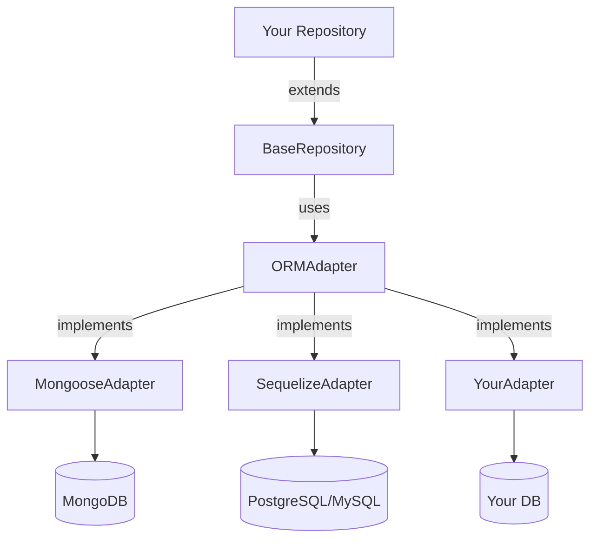

# ORM Support

## Architecture



## Built-in ORMs

- Mongoose (MongoDB)
- Sequelize (PostgreSQL, MySQL, SQLite)

## Mongoose Example

```typescript
import { BaseRepository } from '@sentzunhat/zacatl';
import { Schema } from 'mongoose';

const userSchema = new Schema(
  {
    name: String,
    email: String,
  },
  { timestamps: true },
);

class UserRepository extends BaseRepository<User, CreateUser, UserDTO> {
  constructor() {
    super({ type: 'mongoose', name: 'User', schema: userSchema });
  }

  async findByEmail(email: string) {
    const model = this.model as MongooseModel<User>;
    return this.toLean(await model.findOne({ email }).lean());
  }
}
```

## Sequelize Example

```typescript
import { BaseRepository } from '@sentzunhat/zacatl';
import { Model } from 'sequelize';

class ProductModel extends Model {
  declare id: string;
  declare name: string;
}

class ProductRepository extends BaseRepository<ProductModel, CreateProduct, ProductDTO> {
  constructor() {
    super({ type: 'sequelize', model: ProductModel });
  }
}
```

## Custom Adapter

```typescript
import type { ORMAdapter } from '@sentzunhat/zacatl';

class MyAdapter<D, I, O> implements ORMAdapter<D, I, O> {
  readonly model: any;

  toLean(input: unknown): O | null {
    /* ... */
  }
  async findById(id: string): Promise<O | null> {
    /* ... */
  }
  async create(entity: I): Promise<O> {
    /* ... */
  }
  async update(id: string, update: Partial<I>): Promise<O | null> {
    /* ... */
  }
  async delete(id: string): Promise<O | null> {
    /* ... */
  }
}
```

## BaseRepository API

```typescript
// CRUD
await repo.findById(id);
await repo.create(data);
await repo.update(id, data);
await repo.delete(id);

// Utilities
repo.toLean(document);
repo.isMongoose();
repo.isSequelize();
// Use model directly with type assertion:
// (repo.model as MongooseModel<T>) for Mongoose
// (repo.model as ModelStatic<T>) for Sequelize
```
