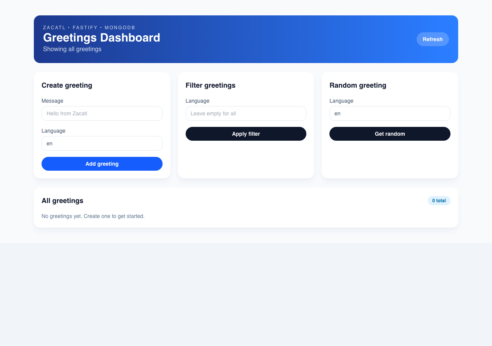
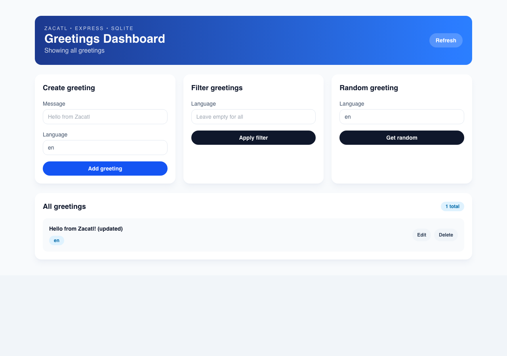

# Zacatl Framework Examples

A catalog of standalone, production-ready server applications demonstrating different patterns and use cases. Each example is fully functional, copy-paste deployable, and follows the same domain logic across different server frameworks and databases.

> **🐳 For Docker:** See [docker.md](./docker.md) - Complete Docker deployment guide and architecture explanation.
> **💾 For Databases:** Use [dev-env]() to run MongoDB + PostgreSQL containers for local development.
> **Note**: Examples use **Node.js 26+** with **npm**.
> **📦 Dependencies:** All examples import from `@zacatl/*` paths — see [shared/zacatl-build-paths.json](./shared/zacatl-build-paths.json) for the standard tsconfig mapping. Run `npm run build` at the repo root before type-checking examples against compiled output.

## Screenshots

Each example implements the same greeting CRUD flow. Screenshots are captured automatically via Playwright:

```bash
npm run screenshots:examples:capture   # requires Docker
```

**Re-run this command whenever you change any example's frontend UI.** The script builds each Docker image, boots it, performs create/delete, and saves three PNGs per example to `examples/screenshots/{name}/`.

### Fastify + SQLite + React · Fastify + SQLite + Svelte

| | Initial | After Create | After Update | After Delete |
|---|---------|-------------|--------------|--------------|
| **React** |  |  |  |  |
| **Svelte** |  |  |  |  |

### Fastify + PostgreSQL + React · Fastify + MongoDB + React

| | Initial | After Create | After Update | After Delete |
|---|---------|-------------|--------------|--------------|
| **PostgreSQL** |  |  |  |  |
| **MongoDB** |  |  |  |  |

### Express + SQLite + React · Express + SQLite + Svelte

| | Initial | After Create | After Update | After Delete |
|---|---------|-------------|--------------|--------------|
| **React** |  |  |  |  |
| **Svelte** |  |  |  |  |

### Express + PostgreSQL + React · Express + MongoDB + React

| | Initial | After Create | After Update | After Delete |
|---|---------|-------------|--------------|--------------|
| **PostgreSQL** |  |  |  |  |
| **MongoDB** |  |  |  |  |

---

### Choose Your Framework & Database

**Choose your platform:**

- **Fastify** ⭐ **RECOMMENDED** - Fastest & most polished
  - `fastify-sqlite-react/` - Fastify + SQLite + React (Backend: 8081, < 1s startup)
  - `fastify-sqlite-svelte/` - Fastify + SQLite + Svelte (Backend: 8081, < 1s startup)
  - `fastify-mongodb-react/` - Fastify + MongoDB + React (Backend: 8082, < 2s startup)
  - `fastify-postgres-react/` - Fastify + PostgreSQL + React (Backend: 8083, < 2s startup)
- **Express** - Traditional Node.js patterns
  - `express-sqlite-react/` - Express + SQLite + React (Backend: 8181)
  - `express-sqlite-svelte/` - Express + SQLite + Svelte (Backend: 8181)
  - `express-mongodb-react/` - Express + MongoDB + React (Backend: 8182)
  - `express-postgres-react/` - Express + PostgreSQL + React (Backend: 8183)
- **Desktop experiment**
  - `neutralino-react-transformers-webgpu/` - Neutralinojs + React + Transformers.js + WebGPU prototype

**All examples include:**

- Identical domain logic and API endpoints
- Production-ready architecture (Hexagonal, DI, Layered)
- CRUD operations for Greeting entity
- TypeScript with strict type checking
- 🐳 Docker Compose support (single image = backend + frontend)

### Example Security Maintenance

After dependency updates in any example, refresh lockfiles and run lockfile-only
audits from each example root to keep vulnerability drift visible and small.

```bash
cd examples/<example-name>
npm install --package-lock-only
npm audit --package-lock-only
```

---

## 📦 Backend Examples - Production Patterns

All examples follow **identical architecture and endpoints** but use different HTTP frameworks (Express/Fastify) and database adapters (SQLite/MongoDB/PostgreSQL).

**Simplified directory structure in each example:**

```
fastify-sqlite-react/
├── backend/              # Backend source
│   ├── src/
│   ├── package.json
│   └── tsconfig.json
├── frontend/             # Frontend source
│   ├── src/
│   ├── package.json
│   └── vite.config.ts
├── package.json          # Monorepo root with workspaces
├── docker-compose.yml
└── README.md
```

**Express examples** - Express.js backend examples

##### express-sqlite-react

**Stack:** Express + SQLite + React
**Setup:** < 1 minute (no external deps)

```bash
cd express-sqlite-react && npm install && npm run dev
# → http://localhost:8181
```

**What it shows:**

- Zacatl Service Framework
- Application/Domain/Infrastructure layers
- tsyringe dependency injection
- SQLite + Sequelize (file-based, perfect for dev)
- Express HTTP platform
- CRUD REST API
- 🐳 Docker Compose support

##### express-mongodb-react

**Stack:** Express + MongoDB + React
**Setup:** 2 minutes (requires MongoDB)

```bash
docker run -d -p 27017:27017 --name mongo mongo:latest
cd express-mongodb-react && npm install && npm run dev
# → http://localhost:8182
```

**What it shows:**

- Same service layer as SQLite example
- Repository pattern with Mongoose adapter
- MongoDB document persistence
- Identical API endpoints

##### express-postgres-react

**Stack:** Express + PostgreSQL + React
**Setup:** 2 minutes (requires PostgreSQL)

```bash
docker run -d --name pg \
  -e POSTGRES_USER=local -e POSTGRES_PASSWORD=local \
  -e POSTGRES_DB=appdb -p 5432:5432 postgres:latest
cd express-postgres-react && npm install && npm run dev
# → http://localhost:8183
```

**What it shows:**

- Relational database with PostgreSQL
- Sequelize ORM for SQL queries
- Production-grade SQL patterns

#### Platform: Fastify ⭐ RECOMMENDED

**Release baseline (minimal): [fastify-sqlite-react](./fastify-sqlite-react/)**

Use this as the primary example for release cleanup and onboarding. It has zero external database setup and the fastest path to a working full-stack flow.

**Why Fastify?** Fastest startup, native TypeScript, excellent performance, full-stack examples.

##### fastify-sqlite-react

**Stack:** Fastify + SQLite + React + Tailwind
**Setup:** < 1 minute

```bash
cd fastify-sqlite-react && npm install && npm run dev
# → http://localhost:8081 (full-stack)
```

**What it shows:**

- Monorepo structure (backend/, frontend/)
- Class-token DI with `@singleton()` and `@inject()`
- React + Tailwind CSS frontend included
- SQLite + Knex for persistence
- Full-stack setup in one folder

##### fastify-mongodb-react

**Stack:** Fastify + MongoDB + React + Tailwind
**Setup:** 2 minutes (MongoDB required)

```bash
docker run -d -p 27017:27017 --name mongo mongo:latest
cd fastify-mongodb-react && npm install && npm run dev
# → http://localhost:8082 (full-stack)
```

**What it shows:**

- Same as SQLite, with MongoDB instead
- Document database patterns
- Mongoose ODM integration

**What you'll learn:**

- React with TypeScript
- API integration patterns
- Configurable backend endpoints
- Vite dev setup

---

## 🏗️ Shared Code

### [shared/domain/](./shared/)

Reusable business logic and data models used across all backend examples.

**Includes:**

- `GreetingService` - Core business logic (create, list, update, delete greetings)
- `GreetingRepository` interface - Storage abstraction (implemented differently per ORM)
- `Greeting` models - Data structures
- Domain ports - Interfaces for adapters

**No dependencies on frameworks or specific databases** - pure domain logic.

---

## � Endpoint Specification

All backend examples implement these 5 identical endpoints under the `/api` prefix:

### Create Greeting

**POST** `/api/greetings`

```json
Request:  { "message": "Hello", "language": "en" }
Response: { "id": "uuid", "message": "Hello", "language": "en", "createdAt": "2024-01-01T00:00:00Z" }
```

### List Greetings

**GET** `/api/greetings?language=en`

```json
Response: [ { "id": "uuid", "message": "Hello", "language": "en", "createdAt": "..." } ]
```

> Plain JSON array — no `{ data: [...] }` wrapper.

### Get Random Greeting

**GET** `/api/greetings/random/{language}`

```json
Response: { "id": "uuid", "message": "Hello", "language": "en", "createdAt": "..." }
```

### Get Single Greeting

**GET** `/api/greetings/{id}`

```json
Response: { "id": "uuid", "message": "Hello", "language": "en", "createdAt": "..." }
```

### Update Greeting

**PATCH** `/api/greetings/{id}`

```json
Request:  { "message": "Updated" }
Response: { "id": "uuid", "message": "Updated", "language": "en", "createdAt": "..." }
```

### Delete Greeting

**DELETE** `/api/greetings/{id}`

```json
Response: { "success": true }
```

> **Fastify note:** Do not send `Content-Type: application/json` on DELETE — Fastify rejects requests where the header is set but the body is empty.

---

## 🔄 Architecture: Same Domain, Different Adapters

```
┌─────────────────────────────────────────────────────────────────┐
│                      Shared Domain Logic                         │
│  (GreetingService, Models, Repository Interface)                 │
│                    (shared/domain/)                              │
└──────────────────┬──────────────────────────────┬────────────────┘
                   │                              │
        ┌──────────┴──────────┐        ┌──────────┴──────────┐
        │                     │        │                     │
   ┌────▼─────────────┐  ┌───▼─────────────┐  ┌───▼─────────────┐
   │  Express         │  │  Fastify        │  │  React Frontend │
   │  (HTTP Layer)    │  │  (HTTP Layer)   │  │  (SPA)          │
   └────┬─────────────┘  └───┬─────────────┘  └─────────────────┘
        │                    │
   ┌────┴─────────┐      ┌───┴─────────┐
   │              │      │             │
┌──▼──────┐  ┌───▼─────┐ ┌──▼──────┐  ┌───▼─────┐
│ SQLite  │  │ MongoDB │ │ SQLite  │  │ MongoDB │
│ (via    │  │ (via    │ │ (via    │  │ (via    │
│Sequelize)  │Mongoose)│ │Sequelize)  │Mongoose)│
└─────────┘  └────────┘ └─────────┘  └────────┘
```

**Key principle:** All implementations follow the same domain logic. Framework and database differences are hidden behind repository adapters.

---

## 🚀 Quick Start

Pick one and run it:

```bash
# Option 1: Fastify + SQLite + React (recommended minimal baseline)
cd fastify-sqlite-react && npm install && npm run dev

# Option 2: Fastify + MongoDB + React (scale-up path)
docker run -d -p 27017:27017 --name mongo mongo:latest
cd fastify-mongodb-react && npm install && npm run dev

# Option 3: Express + SQLite + React
cd express-sqlite-react && npm install && npm run dev

# Option 4: Express + MongoDB + React
docker run -d -p 27017:27017 --name mongo mongo:latest
cd express-mongodb-react && npm install && npm run dev
```

Docker Compose examples keep database state in predictable defaults: SQLite
uses each example's `./data` folder by default, MongoDB uses the Docker-managed
`mongo-data` volume, and PostgreSQL uses the Docker-managed `postgres-data`
volume. Shared compose defaults live in `compose/databases/`; each example
extends the relevant default file and keeps only its example-specific port,
container, build, and init-script settings. MongoDB and PostgreSQL sidecars
default to `mongo:latest` and `postgres:latest`; pin them with
`ZACATL_EXAMPLE_MONGO_IMAGE` or `ZACATL_EXAMPLE_POSTGRES_IMAGE` before deploying
if your environment requires digest-stable images.

---

## 📚 Additional Resources

- 

---

## ✅ Validation Checklist

Each example should pass:

- [ ] `npm install` succeeds
- [ ] `npm run dev` starts server on assigned port without errors
- [ ] All endpoints respond with valid JSON
- [ ] Database operations (CRUD) work correctly — create, list, delete
- [ ] README.md documents setup and port usage
- [ ] `.env.example` provided with all required variables
- [ ] `npm run build` produces no errors
- [ ] `npm run type:check` passes at repo root
- [ ] `npm run lint` passes at repo root
- [ ] Screenshots updated: `npm run screenshots:examples:capture` (requires Docker)

---

## 🤝 Contributing

To add a new example:

2. Use identical endpoints as other examples
3. Reuse shared domain logic from `shared/domain/`
4. Document setup steps in README.md
5. Include `.env.example` with all environment variables
6. Run `npm run screenshots:examples:capture` and commit the new screenshots under `examples/screenshots/{name}/`

**When editing an existing example's frontend UI**, always re-run `npm run screenshots:examples:capture` and commit the updated PNGs alongside your code changes. The script handles Docker build + boot + capture automatically.

---

## 📞 Support


---

**Last Updated:** July 9, 2026
